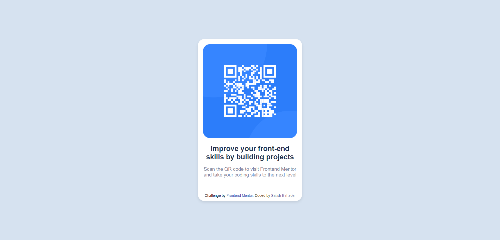

# Frontend Mentor - QR code component solution

This is a solution to the [QR code component challenge on Frontend Mentor](https://www.frontendmentor.io/challenges/qr-code-component-iux_sIO_H). Frontend Mentor challenges help you improve your coding skills by building realistic projects. 

## Table of contents

- [Frontend Mentor - QR code component solution](#frontend-mentor---qr-code-component-solution)
  - [Table of contents](#table-of-contents)
  - [Overview](#overview)
    - [Screenshot](#screenshot)
    - [Links](#links)
  - [My process](#my-process)
    - [Built with](#built-with)
    - [Useful resources](#useful-resources)
  - [Author](#author)
  - [Acknowledgments](#acknowledgments)

## Overview

### Screenshot

#### Desktop View

#### Mobile View

### Links

- Solution URL: [https://github.com/SatishB15/qr-code-component](https://github.com/SatishB15/qr-code-component)
- Live Site URL: [https://vercel.com/satish-birhade/qr-code-component/Aw6G7UyFi7m2feqoM9MMXZAgPYGE](https://vercel.com/satish-birhade/qr-code-component/Aw6G7UyFi7m2feqoM9MMXZAgPYGE)

## My process

### Built with

- Semantic HTML5 markup
- CSS custom properties
- Flexbox
- Mobile-first workflow

### Useful resources

- [CSS Flexbox](https://developer.mozilla.org/en-US/docs/Learn/CSS/CSS_layout/Flexbox) - This resource helped me understand the fundamentals of Flexbox, enabling me to create responsive layouts with ease. I really liked this pattern and will use it in my future projects.
- [How to use google fonts](https://www.w3schools.com/css/css_font_google.asp) - This is an amazing article that helped me finally understand how to integrate Google Fonts into my projects. I'd recommend it to anyone still learning this concept as it simplifies the process and offers clear examples.

## Author

- Frontend Mentor - [@SatishB15](https://www.frontendmentor.io/profile/SatishB15)
- Twitter - [@BirhadeSatish](https://x.com/BirhadeSatish)
- LinkedIn - [Satish Birhade](www.linkedin.com/in/satish-birhade)

## Acknowledgments

I am pleased to announce that I have successfully completed my first task on the Frontend Mentor platform. This experience has been incredibly rewarding, and I have gained valuable skills and insights into front-end development. I am excited to continue my journey and tackle more challenges to further enhance my abilities.
